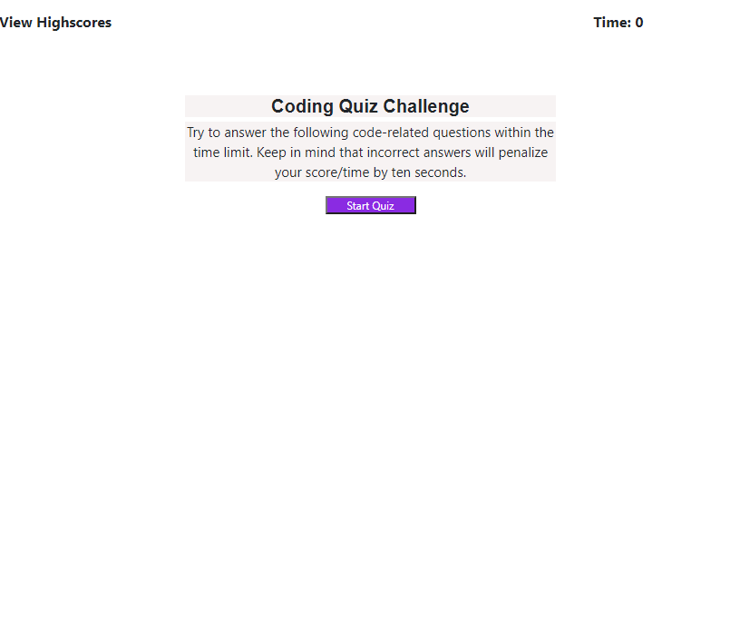
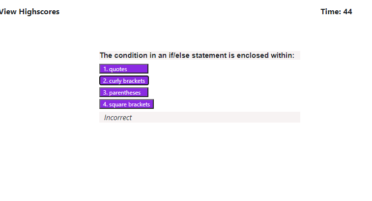
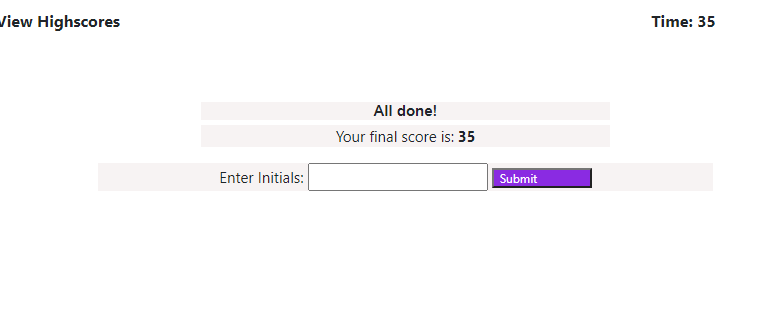
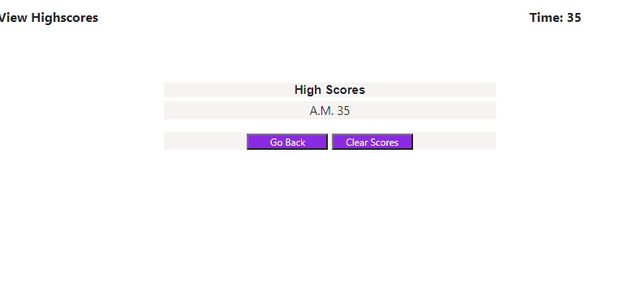
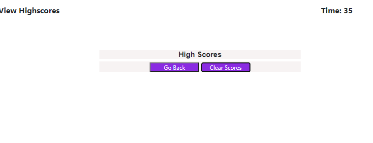

# Web API Quiz (Homework #4)
The application saved in this repo is a time based coding assessment quiz. In this application, there are five multiple choice questions presented to the user.
The questions, options and correct answers are stored in an array of object for easy reference.

# Functions
The task in this application were broken down in several functions, some of which are attached to event listeners.

spreadChoices()
- This function is used to 'spread' values stored in the object array. This function reduces the amount of code significantly.

checkAnswer()
- This is the main function in the program. It evaluates the options selected by the user and returns a message showing whether the answer is correct/incorrect. In addition, this function performs a self-imposed loop to go thru all the questions stored in the object array.

startQuiz()
- Attached to the startQuizButton event listener, this function serves as the spark of the application. Once started, it will chain with the checkAnswer() function to ensure that all questions are presented.

The rest of the function are either auxiliary functions or smaller functions attached to event listeners.

# Concepts Applied

The following are some of the WEB API ocncepts applied in this application:
    Node,
    Elements,
    Event Listener,
    Prevent Default,
    Local Storage,
    Query Selector,

# The application could be accessed using the following link:
https://apolinar291076.github.io/Web-API-Quiz

# The repo for the application could be accessed using the following link:
 https://github.com/Apolinar291076/Web-API-Quiz.git
 
 
 # Screenshots
 
 Intro Page Screen:
 
 

 
 Question completed by the user with result:
 
 

 
 Result of the quiz after answering all questions:
 
 

  
 High Score Display:
 
 

 
 Clear Score command executed:
 
 

  
 
 
 
